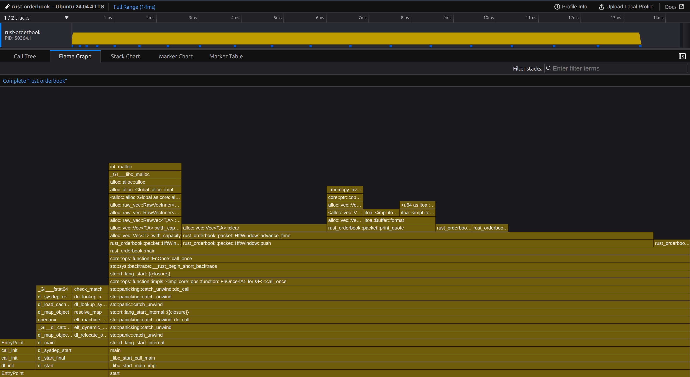

# Rust Orderbook

A command-line tool, written in Rust, that extracts and prints quote messages from a pcap capture of a market data feed. When given the -r flag it reorders output by the exchange's quote accept time.

## Features
- Stream-oriented: processes pcap without loading the whole file into memory.
- Reordering mode (-r): outputs messages ordered by quote accept time using a bounded-time window (±3s) to limit memory usage.
- Filters UDP payloads for packets starting with ASCII B6034 and parses quote fields according to the provided specification.

## Reordering behavior and performance
- -r reorders by quote accept time, assuming the difference between accept time and pcap packet time is <= 3 seconds.
- Streaming, bounded-memory approach:

    - Maintain an in-memory buffer keyed by accept time.
    - Push parsed messages into the buffer as they are read.
    - Track the maximum observed packet timestamp and flush buffered messages whose accept time is older than (max_packet_time - 3s).

- Designed to work efficiently on files larger than available RAM: minimal allocations, byte-slice parsing, and streaming pcap reading.

### To build the program
```
 RUSTFLAGS="-C target-cpu=native" cargo build --release
```

### To run the program

```
cargo run --release -- --file "./data/mdf-kospi200.20110216-0.pcap" -r > ./output/output.txt
```

### Timed outputs

With 3 second time bound check
```
time target/release/rust-orderbook --file ./data/mdf-kospi200.20110216-0.pcap -r > /dev/null

real    0m0.022s
user    0m0.018s
sys     0m0.004s
```

Without any time bound checks 

```
time target/release/rust-orderbook --file ./data/mdf-kospi200.20110216-0.pcap > /dev/null

real    0m0.016s
user    0m0.011s
sys     0m0.005s
```

### Samply




### System configuration

> Architecture: x86_64 — Intel(R) Core(TM) i7-4770HQ @ 2.20GHz

```text
Architecture:                x86\_64
CPU op-mode(s):             32-bit, 64-bit
Address sizes:              39 bits physical, 48 bits virtual
Byte Order:                 Little Endian

CPU(s):                     8
On-line CPU(s) list:        0-7
Vendor ID:                  GenuineIntel
Model name:                 Intel(R) Core(TM) i7-4770HQ CPU @ 2.20GHz
CPU family:                 6
Model:                      70
Thread(s) per core:         2
Core(s) per socket:         4
Socket(s):                  1
Stepping:                   1
CPU(s) scaling MHz:         58%
CPU max MHz:                3400.0000
CPU min MHz:                800.0000
BogoMIPS:                   4389.93


Virtualization features:
Virtualization:             VT-x

Caches (sum of all):
L1d:                        128 KiB (4 instances)
L1i:                        128 KiB (4 instances)
L2:                         1 MiB (4 instances)
L3:                         6 MiB (1 instance)
L4:                         128 MiB (1 instance)

NUMA:
NUMA node(s):               1
NUMA node0 CPU(s):          0-7

Vulnerabilities:
Gather data sampling:       Not affected
Indirect target selection:  Not affected
Itlb multihit:              KVM: Mitigation: VMX disabled
L1tf:                       Mitigation; PTE Inversion; VMX conditional cache flushes, SMT vulnerable
Mds:                        Mitigation; Clear CPU buffers; SMT vulnerable
Meltdown:                   Mitigation; PTI
Mmio stale data:            Unknown: No mitigations
Reg file data sampling:     Not affected
Retbleed:                   Not affected
Spec rstack overflow:       Not affected
Spec store bypass:          Mitigation; Speculative Store Bypass disabled via prctl
Spectre v1:                 Mitigation; usercopy/swapgs barriers and __user pointer sanitization
Spectre v2:                 Mitigation; Retpolines; IBPB conditional; IBRS\_FW; STIBP conditional; RSB filling; PBRSB-eIBRS Not affected; BHI Not affected
Srbds:                      Mitigation; Microcode
Tsa:                        Not affected
Tsx async abort:            Not affected
Vmscape:                    Mitigation; IBPB before exit to userspace
```
